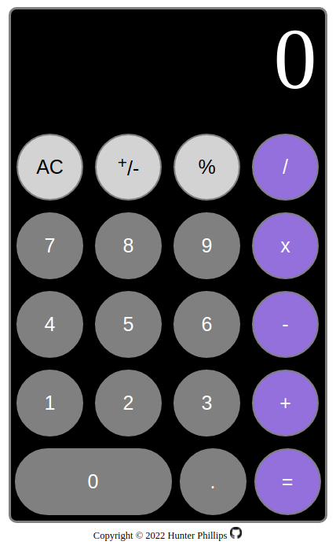

# Calculator
- This calculator app performs basic functions.
- It was completed as part of The Odin Project's Foundations course.
- JavaScript, CSS, and HTML were utilized.

<a href="https://hunt0419.github.io/calculator/">Live Version</a>